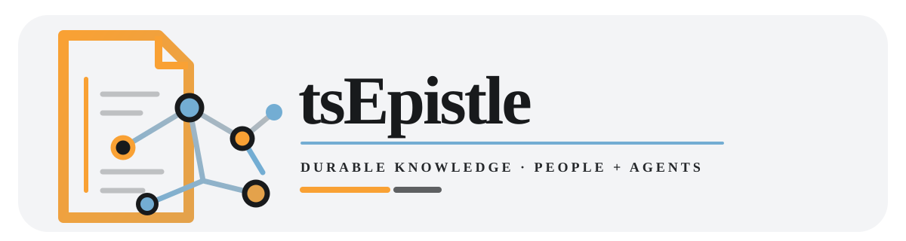
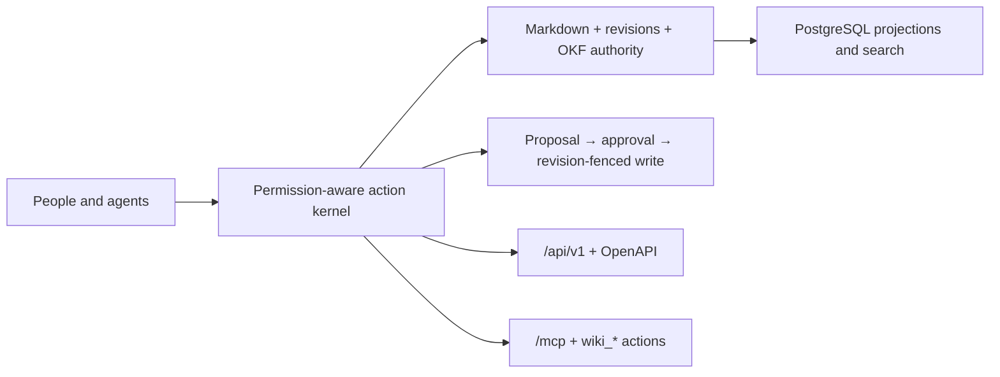

<div align="center">



**Durable, human-readable knowledge for people and agents.**

[](https://github.com/PhilosophiMoonbeam/tsEpistle/blob/main/package.json)
[](https://github.com/PhilosophiMoonbeam/tsEpistle/actions/workflows/build.yml)
[](LICENSE)
[](https://bun.com/)
[](https://www.postgresql.org/)

</div>

> **Preview software:** The current preview is `0.1.0-alpha.1`. tsEpistle is an independent, non-endorsed Wiki.js fork based on upstream `2.5.314`. There is **no supported published release yet**. Do not use `main`, a canary image, or a local build as a production release; test any deployment with recoverable backups and an operator canary.

## What tsEpistle is

tsEpistle is a fork-first knowledge system for durable pages that humans can read, revise, cite, and carry forward—and that agents can retrieve and change through the same permission boundaries. It is not an official Wiki.js release and is not produced or endorsed by Nicolas Giard or Requarks.

The product is alpha. Expect changing contracts, incomplete operational evidence, and migration or deployment work that still requires an informed operator. Read the [security policy](SECURITY.md) before exposing an instance.

## Architecture, not slogans

- **Authority stays legible.** Authored Markdown and its immutable revisions are the source of truth. OKF metadata travels with that authority record, while rendered pages, links, knowledge, and search are revision-matched projections.
- **Search stays inspectable.** PostgreSQL is the only supported search engine and projection store. Full-text, metadata, bounded link ranking, and ACL filtering run through the PostgreSQL retrieval contract; derived indexes can be rebuilt from canonical pages.
- **Agents share the human boundary.** The inline Wiki Agent and external MCP clients use one permission-aware action kernel and the same public `wiki_*` actions. MCP is an exact `/mcp` surface, not a second login or a bypass around page rules.
- **Agent and MCP writes start as proposals.** Knowledge-changing writes initiated through the inline Wiki Agent or external MCP clients are proposal-first, revision-fenced, and approval-aware. Ordinary human edits are outside this proposal path. At application time, live authorization and the current source revision are checked again before a write is accepted.
- **The external API has a boundary.** `/api/v1` is the versioned REST surface, with its OpenAPI 3.1 contract at `/api/v1/openapi.json`; additive preview changes may happen within v1, while incompatible changes require a new version.
- **Optional means off.** Agent provider, orchestration, goals, browser, skills, proposals, writes, and MCP capabilities are disabled by default. Enable only the surfaces an operator has configured and reviewed.



See the [search architecture](docs/search-architecture.md), [agent deployment guide](docs/agents-deployment.md), and [API versioning policy](docs/api-versioning.md) for the executable boundaries behind this overview.

## Current stack

The versions below are the repository's declared runtime and package metadata; database support is the application's supported PostgreSQL range.

| Layer | Current choice |
| --- | --- |
| Runtime and package manager | Bun 1.4.0 (`packageManager`; engines `>=1.4.0 <2`) |
| Server | Express 5.2.1, Pug 3.0.4 |
| Client | Vue 3.5.41, Vuetify 4.1.9, Vite 8.2.1 |
| Language | TypeScript 6.0.2 |
| Data and projections | PostgreSQL 15–18 via `pg` 8.23.0 |
| Agent transport | Model Context Protocol packages 2.0.0 |

## Try it locally

### Docker Compose

The checked-in example runs tsEpistle with PostgreSQL and publishes the wiki on port 80. Keep the password file outside version control and readable only by the operator.

```console
install -m 600 /dev/null wiki-db-password
printf '%s\n' 'replace-with-a-strong-password' > wiki-db-password
WIKI_DB_PASSWORD_FILE="$PWD/wiki-db-password" docker compose -f dev/examples/docker-compose.yml up -d
```

Set `WIKI_IMAGE` to an immutable tag or digest when overriding the example image. Put TLS at a maintained reverse proxy; the example exposes HTTP on port 80.

### Source development

Install dependencies and start development (long-running):

```console
bun install --frozen-lockfile
bun run dev
```

Run the independent quality gate:

```console
bun run ci
```

`bun run dev` starts the watched server and Vite client together. `bun run ci` is the repository's local quality contract, including checks, tests, and the production build.

## Deployment and recovery

Use the [Helm guide](dev/helm/README.md) for Kubernetes installation and lifecycle details. PostgreSQL 15, 16, 17, and 18 are supported on current minor releases. The only supported Wiki.js migration source is exactly Wiki.js `2.5.314`; other upstream versions and other database engines are unsupported. Follow the [Wiki.js migration guide](MIGRATION.md) for the validated clone, quarantine, verification, cutover, and rollback procedure.

> **Backup contract:** Back up PostgreSQL and `/wiki/data` together before every upgrade. Stop all tsEpistle instances, restore both from the same pre-upgrade point, and only then roll back to the old image. Rolling back application or Helm resources without the matching database and data restore can run old code against a newer schema and is unsafe.

When a release is published, use the [release page](https://github.com/PhilosophiMoonbeam/tsEpistle/releases) for its immutable image/archive and verify its checksums and provenance before deployment. Those release-verification instructions apply **once published**; no official tsEpistle release artifacts are supported yet.

## Project links

| Need | Link |
| --- | --- |
| Source repository | [PhilosophiMoonbeam/tsEpistle](https://github.com/PhilosophiMoonbeam/tsEpistle) |
| Issues and support | [GitHub Issues](https://github.com/PhilosophiMoonbeam/tsEpistle/issues) |
| Releases (when published) | [GitHub Releases](https://github.com/PhilosophiMoonbeam/tsEpistle/releases) |
| Helm deployment | [dev/helm/README.md](dev/helm/README.md) |
| Wiki.js migration | [MIGRATION.md](MIGRATION.md) |
| Agent deployment and operations | [docs/agents-deployment.md](docs/agents-deployment.md) |
| Search architecture | [docs/search-architecture.md](docs/search-architecture.md) |
| API versioning | [docs/api-versioning.md](docs/api-versioning.md) |
| Security policy | [SECURITY.md](SECURITY.md) |
| Threat model | [docs/security/threat-model.md](docs/security/threat-model.md) |

## Contributing

Use this fork's [GitHub Issues](https://github.com/PhilosophiMoonbeam/tsEpistle/issues) for contribution discussion, questions, and bug reports. Keep pull requests focused and include their purpose, execution steps, and verification evidence. For suspected vulnerabilities, do not open a public issue or pull request; use the private-report path in [SECURITY.md](SECURITY.md).

## Branch model

- [`main`](https://github.com/PhilosophiMoonbeam/tsEpistle/tree/main) is the authoritative tsEpistle product branch; releases and deployments originate there.
- [`upstream-main`](https://github.com/PhilosophiMoonbeam/tsEpistle/tree/upstream-main) is a read-only mirror of `requarks/wiki:main`; fork-specific commits do not land there.
- Upstream updates move through a short-lived integration branch, are adapted and verified, and are then merged into `main`. Product history is not rebased onto upstream.

## Attribution and license

tsEpistle was materially modified on 2026-08-13 by contributors to this repository. This fork does not claim ownership of upstream work. Wiki.js was created by Nicolas Giard and developed by Requarks and its contributors; historical notices and credits remain preserved in [`NOTICE`](NOTICE). See the [upstream Wiki.js project](https://github.com/Requarks/wiki) for official Wiki.js releases and documentation.

This project is licensed under the [GNU Affero General Public License v3](LICENSE). If you run a modified tsEpistle instance over a network, you must offer the complete Corresponding Source for that exact running version, including the build inputs needed to reproduce it.

The upstream project's funding link is retained for attribution: [support Wiki.js](https://github.com/users/NGPixel/sponsorship).
