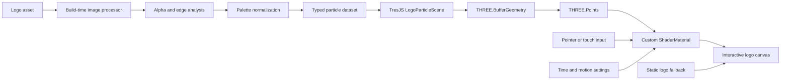

# Proposal: Interactive TresJS Particle Logo for Wiki Login

## Project objective

Replace the static company logo on the TypeScript/Vue-based Wiki login screen with an interactive, image-derived particle rendering built with **TresJS and Three.js**.

The logo will:

- Preserve the source image’s recognizable shape and color identity.
- Use a simplified version of the source palette rather than one uniform color.
- Render as particles with variable size, opacity, and depth.
- Respond subtly to mouse, pen, and touch movement.
- Return smoothly to its original form after interaction.
- Remain decorative and never interfere with authentication, accessibility, or page performance.
- Fall back to the normal logo if WebGL is unavailable or motion is reduced.

The recommended design uses one GPU-rendered `THREE.Points` object within a TresJS scene. It does not require a physical particle simulation or continuous CPU-side position updates.

---

## Visual direction

The logo should appear fully assembled and recognizable when the page loads. It should feel like an enhanced brand element, not a loading animation or game.

### Default state

- Particles reproduce the logo’s silhouette, internal shapes, and major color regions.
- Point size and opacity vary according to source alpha, luminance, edge importance, and controlled random variation.
- A small amount of depth separates particles from a perfectly flat plane.
- Slow ambient movement creates a restrained “breathing” effect.
- Movement remains low enough that text and fine logo details do not shimmer.

### Pointer and touch response

When the pointer approaches the logo:

1. Nearby particles move away from the interaction point.
2. Faster pointer movement creates a small directional wake.
3. Particles outside the interaction radius remain stable.
4. Displaced particles return smoothly to their source positions.
5. The logo can shift by a few pixels or rotate by approximately 1–2 degrees to create parallax.

The effect will be intentionally restrained for a login screen. It should reward interaction without competing with the form.

### Reduced-motion state

When `prefers-reduced-motion: reduce` is active:

- Disable ambient movement and particle displacement.
- Display either a static particle rendering or the standard logo image.
- Avoid automatic rotation, pulsing, scattering, and assembly animations.

---

## Color and palette treatment

The particle system will preserve the image’s color character while simplifying the palette for clarity and visual stability.

### Recommended palette process

The input image will be processed into approximately **6–12 representative colors**:

1. Ignore fully transparent pixels.
2. Read source colors in the correct sRGB color space.
3. Group similar colors using palette quantization.
4. Remove insignificant colors caused by antialiasing or compression.
5. Preserve important brand colors even if they occupy a small region.
6. Map each retained particle to the closest normalized palette color.
7. adjust particle lightness when necessary to maintain contrast against the login background.

Palette reduction provides several benefits:

- Cleaner visual identity.
- Less noisy color variation.
- Better recognition at low particle counts.
- More predictable appearance across screens.
- Easier adaptation between light and dark login themes.

The source image remains the authority for particle placement and color regions. Palette normalization does not mean converting the logo to monochrome.

### Configurable color modes

The component should support:

```ts
type ParticleColorMode =
  | 'source'
  | 'quantized'
  | 'provided-palette'
```

- **`source`:** Uses sampled source colors with minimal normalization.
- **`quantized`:** Automatically derives a limited palette.
- **`provided-palette`:** Maps source colors to an approved brand palette.

For production, `provided-palette` is preferred when formal brand colors are available. Otherwise, `quantized` is the recommended default.

---

## Source asset handling

The system should accept:

- Transparent PNG
- Transparent WebP
- SVG
- Raster logo with a separate transparency or subject mask

SVG is useful for a company logo because it may already contain clean shapes and approved colors. However, the particle renderer will still rasterize it to an offscreen canvas before sampling. It is not necessary to convert an existing high-quality PNG or WebP to SVG.

The production asset should:

- Have a transparent background.
- Use the official color profile and brand colors.
- Include enough resolution for clean sampling.
- Be served from the same origin as the Wiki, or use correct CORS headers.
- Have whitespace cropped consistently around the logo.

---

## Technical architecture



### Rendering layer

TresJS will manage the Vue integration, renderer, camera, scene, and render loop. Three.js classes will be used directly where lower-level control is beneficial.

Primary technologies:

- Vue 3
- TypeScript
- `@tresjs/core`
- Three.js
- Custom GLSL vertex and fragment shaders
- Vite-compatible shader imports or TypeScript shader strings

TresJS officially supports rendering a custom `THREE.Points` object through `<primitive>`, using `BufferGeometry` and typed attributes. Its `useLoop()` composable provides per-frame `elapsed` and `delta` values for updating shader uniforms.

### Proposed component structure

```text
src/
├─ components/
│  └─ login-logo/
│     ├─ LoginParticleLogo.vue
│     ├─ LogoParticleScene.vue
│     ├─ useLogoPointer.ts
│     ├─ particle-logo.types.ts
│     └─ shaders/
│        ├─ particle.vert.glsl
│        └─ particle.frag.glsl
├─ assets/
│  └─ branding/
│     ├─ company-logo.svg
│     ├─ company-logo.particles.bin
│     └─ company-logo-fallback.webp
└─ tools/
   └─ generate-particle-logo.ts
```

### Component responsibilities

**`LoginParticleLogo.vue`**

- Owns the responsive container.
- Places the canvas behind or beside the login form.
- Collects DOM-level pointer movement without blocking form interaction.
- Selects static, reduced-motion, or animated rendering.
- Handles loading and WebGL failure.

**`LogoParticleScene.vue`**

- Creates the `BufferGeometry`, shader material, and `THREE.Points`.
- Updates time, pointer, velocity, and display uniforms.
- Configures the camera and scene.
- Disposes GPU resources when unmounted.

**`useLogoPointer.ts`**

- Converts browser pointer coordinates into logo-local coordinates.
- Smooths pointer position and velocity.
- Handles pointer exit and touch behavior.
- Does not call `preventDefault()` or capture ordinary page gestures.

---

## Particle data model

Each particle will contain compact GPU attributes:

```ts
interface ParticleDataset {
  positions: Float32Array
  colors: Float32Array
  sizes: Float32Array
  opacities: Float32Array
  seeds: Float32Array
  count: number
  width: number
  height: number
}
```

Corresponding geometry attributes:

```ts
geometry.setAttribute(
  'position',
  new THREE.BufferAttribute(dataset.positions, 3),
)

geometry.setAttribute(
  'aColor',
  new THREE.BufferAttribute(dataset.colors, 3),
)

geometry.setAttribute(
  'aSize',
  new THREE.BufferAttribute(dataset.sizes, 1),
)

geometry.setAttribute(
  'aOpacity',
  new THREE.BufferAttribute(dataset.opacities, 1),
)

geometry.setAttribute(
  'aSeed',
  new THREE.BufferAttribute(dataset.seeds, 1),
)
```

These buffers remain unchanged during normal animation. Motion is calculated in the vertex shader, preventing per-frame iteration over thousands of particles in JavaScript.

---

## TresJS scene design

```vue
<script setup lang="ts">
import { TresCanvas } from '@tresjs/core'
import LogoParticleScene from './LogoParticleScene.vue'

defineProps<{
  particleDataUrl: string
  reducedMotion: boolean
}>()
</script>

<template>
  <div class="particle-logo" aria-hidden="true">
    <TresCanvas
      alpha
      :clear-alpha="0"
      :antialias="false"
      :dpr="[1, 1.5]"
      :fps-limit="reducedMotion ? 1 : 60"
      render-mode="always"
    >
      <TresOrthographicCamera
        :args="[-1, 1, 1, -1, 0.1, 10]"
        :position="[0, 0, 2]"
      />

      <LogoParticleScene
        :particle-data-url="particleDataUrl"
        :reduced-motion="reducedMotion"
      />
    </TresCanvas>
  </div>
</template>
```

An orthographic camera is recommended because it preserves the logo’s proportions and prevents perspective distortion. Perspective can be reconsidered if later art direction calls for a stronger three-dimensional effect.

TresJS provides configurable DPR, FPS limits, transparent canvas backgrounds, render modes, and custom cameras through `TresCanvas`.

---

## Shader design

### Vertex shader responsibilities

The vertex shader will calculate:

- Base particle position.
- Minimal seed-based idle movement.
- Pointer distance and interaction falloff.
- Radial displacement.
- Directional wake from pointer velocity.
- Optional depth parallax.
- Final point size.

The displacement is computed from the original position every frame. As pointer influence decays, particles automatically return to their proper positions without a CPU physics engine.

### Fragment shader responsibilities

The fragment shader will:

- Convert square WebGL points into soft circles.
- Apply each particle’s palette color.
- Apply source-derived opacity.
- Soften particle edges.
- Discard nearly transparent fragments.
- Optionally adjust contrast for the login background.

Conceptually:

```glsl
vec2 point = gl_PointCoord - 0.5;
float distanceFromCenter = length(point);
float circle = 1.0 - smoothstep(0.36, 0.5, distanceFromCenter);

float alpha = circle * vOpacity * uGlobalOpacity;

if (alpha < 0.01) {
  discard;
}

gl_FragColor = vec4(vColor, alpha);
```

Recommended material settings:

```ts
const material = new THREE.ShaderMaterial({
  vertexShader,
  fragmentShader,
  uniforms,
  transparent: true,
  depthWrite: false,
  depthTest: false,
  blending: THREE.NormalBlending,
})
```

Normal blending should be used initially because additive blending can wash out or change approved brand colors.

---

## Login-screen integration

The interactive rendering must not become a dependency of authentication.

The login screen should follow this visual order:

```text
Semantic login form and static logo
        ↓
Particle dataset begins loading
        ↓
TresJS initializes successfully
        ↓
Particle logo fades in
        ↓
Static visual fades out or remains as a hidden fallback
```

Requirements:

- The username and password fields are usable before TresJS finishes loading.
- A shader, image, or WebGL failure does not affect login.
- The canvas must not cover the form’s focus outline or validation messages.
- The canvas should be marked `aria-hidden="true"`.
- The meaningful logo name remains available through the ordinary image or nearby text.
- The canvas should not be keyboard-focusable.
- Pointer collection should occur on the decorative container, not on login controls.
- Authentication code and particle-rendering code remain separate modules.

Lazy-loading the particle scene is recommended so the login form and authentication bundle are not delayed by Three.js.

---

## Performance targets

Initial quality levels:

| Tier | Particle count | DPR cap | Frame rate |
|---|---:|---:|---:|
| Low-power/mobile | 4,000–8,000 | 1.0 | 30 FPS |
| Standard | 8,000–18,000 | 1.5 | 45–60 FPS |
| High-quality desktop | 18,000–30,000 | 1.5 | 60 FPS |

Recommended production target: **8,000–18,000 particles**. Logos generally need fewer samples than photographic portraits because their shapes and color regions are cleaner.

Additional controls:

- Pause rendering when the document is hidden.
- Pause or reduce updates when the logo is outside the viewport.
- Avoid bloom and multipass post-processing.
- Avoid real-time image processing on every visit.
- Generate particle data during the build or asset-preparation process.
- Load only one particle dataset.
- Dispose geometry and shader material on Vue component unmount.
- Do not update geometry attributes each frame.
- Keep particle sizes moderate to limit transparent fragment overdraw.

TresJS documentation notes that primitive geometry and materials must be explicitly disposed or provided a disposal function.

---

## Configuration interface

```ts
export interface LoginParticleLogoOptions {
  source: string
  fallbackSource: string

  paletteMode: 'source' | 'quantized' | 'provided-palette'
  palette?: string[]
  paletteSize?: number

  desktopParticleCount?: number
  mobileParticleCount?: number

  pointSize?: number
  pointSizeVariation?: number
  globalOpacity?: number

  idleStrength?: number
  idleSpeed?: number
  depthStrength?: number

  interactionRadius?: number
  interactionStrength?: number
  wakeStrength?: number
  pointerSmoothing?: number

  backgroundColor?: string
  reducedMotionBehavior?: 'static-particles' | 'fallback-image'
}
```

This keeps brand, performance, and motion decisions configurable without changing shader code.

---

## Deliverables

1. Responsive Vue/TresJS particle-logo component.
2. TypeScript configuration and particle data types.
3. Build-time particle dataset generator.
4. Source, quantized, and approved-palette color modes.
5. Custom vertex and fragment shaders.
6. Mouse, pen, and touch interaction.
7. Reduced-motion behavior.
8. Static logo and WebGL failure fallback.
9. Responsive desktop and mobile quality levels.
10. GPU resource cleanup and visibility pausing.
11. Integration documentation for the Wiki login screen.
12. Browser and device testing report.

---

## Acceptance criteria

The implementation will be considered complete when:

- The logo is immediately recognizable at its intended display size.
- Major source colors are preserved or mapped to approved brand colors.
- No unintended monochrome rendering or additive color washout occurs.
- Particle movement remains smooth on supported desktop and mobile devices.
- Pointer displacement is localized and returns cleanly to the logo.
- Touch interaction does not prevent page scrolling or form use.
- The login form works before and during particle-scene loading.
- WebGL failure produces a normal static logo with no authentication impact.
- Reduced-motion users receive a static presentation.
- The canvas is decorative and excluded from the accessibility tree.
- GPU resources are released when the component unmounts.
- No continuous CPU-side particle loop is used.
- The final implementation meets the agreed performance budget.

## Final recommendation

Proceed with a **build-time generated, palette-normalized particle dataset rendered through `THREE.Points` inside TresJS**. Use an orthographic camera, custom GPU shaders, normal alpha blending, and restrained pointer displacement.

This architecture preserves the company logo’s multicolor identity while delivering the desired motion. It also keeps the login screen fast, accessible, and independent from the authentication workflow.

Relevant TresJS documentation:

- [TresCanvas configuration](https://docs.tresjs.org/api/components/tres-canvas.html)
- [Primitives and particle systems](https://docs.tresjs.org/api/advanced/primitives.html)
- [Render loop](https://docs.tresjs.org/api/composables/use-loop.html)
- [Pointer events](https://docs.tresjs.org/api/events/pointer-events.html)
