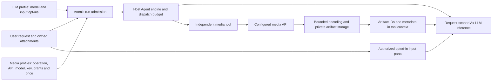

# Agent media: independent tools and explicit model inputs

## Assessment and the original defects

The maintained integration uses `@ax-llm/ax` **25.0.0** for generative inference, image chat and transcription. The application owns authorization, run leases, tool execution, accounting, context compaction and continuation integrity. Request-scoped Ax services sit behind the existing DNS-pinned, bounded provider fetch. Keeping that host loop is intentional: replacing it with an independent AxAgent/AxBalancer loop would not automatically preserve these application contracts.

The original image-model lock had four independent causes: a readonly administration field, a client save payload containing a fixed model, a server `z.literal` model schema, and a transport dispatching a module constant instead of the configured model. Changing only the field would not fix the API request. The separate media configuration now binds the editable model to the actual guarded endpoint and request.

Gemini **LLM** inference still uses Ax's stateless GenerateContent transport, not the Interactions API. The former Omni video and Lyria music settings therefore could not perform those operations. They were neither LLM input capabilities nor working generation controls. Interactions is now a separate **media-only** adapter; it does not change Gemini chat, provider-native continuation or the canonical conversation store.

Native SDK feature hints are not complete protocol proof. With this pinned Ax version, actual Responses requests support images/PDFs even when `getFeatures()` reports false; Anthropic PDF parts fail before dispatch; Gemini's native file path supports video/WebM despite incomplete hints. The shared implemented transport/format matrix and an administrator's exact-model opt-in govern admission. Positive native size/duration restrictions remain additional limits. A checkbox is not evidence that a vendor account can access a model.

## Architecture

Generation and model input are separate authorities:

- An OpenAI text-only LLM can invoke a Gemini image tool. A Gemini LLM can invoke OpenAI Images or standalone Stability Core. Generation never changes the chosen LLM merely because a media operation is requested.
- Each media profile represents one operation: image, video, music or transcription. It has its own API, model, official endpoint, credential, exposure/grants, input/output exposure ceilings, timeout and pricing. No LLM profile is required for a media-only vendor.
- Enabled authorized profiles resolve independently per operation: eligible operation default first, otherwise stable display-name/profile-ID order. There is no user-facing provider/model selector.
- Admission pins immutable media version IDs into the canonical admission/queued event alongside the LLM binding. Goals and durable continuations retain their authoritative bindings. Current account access, grants, enabled state, current version and credential readiness are rechecked after guarded DNS resolution, immediately before credential-bearing HTTP dispatch. A changed binding fails closed; it does not silently substitute another model or retry paid generation. This protects the host dispatch boundary, not instantaneous cancellation of an already-dispatched remote request.
- Ordinary run generation controls restrict offered tools. An explicit direct media response uses its matching admitted operation. Planners and child inference do not acquire root generation authority.

### Implemented generation APIs

| API | Operation | Reference input | Configuration boundary |
| --- | --- | --- | --- |
| Gemini GenerateContent through Ax | Image generation/editing | PNG/JPEG/WebP images | Configured Gemini image model |
| Gemini GenerateContent through Ax transcription | Transcription/dictation | One supported audio file | Configured transcription model |
| Google Interactions, media-only REST | Omni video | Images | Exact supported Omni model; no Veo substitution |
| Google Interactions, media-only REST | Lyria music | None | Exact supported Lyria model |
| OpenAI Images | GPT Image generation/editing | PNG/JPEG/WebP images | Configured supported GPT Image model; generations or multipart edits |
| Stability Stable Image Core | Image generation | None | Core product endpoint and fixed per-generation pricing |

These are real distinct adapters, not generic endpoint guesses. Unsupported combinations are rejected before egress. There is no remote output-URL download fallback: generated bytes must be returned through the supported bounded response and pass validation. Stability Core does not advertise editing/reference-image support.

## When media enters the model context

In the LLM profile editor, explicitly enable **Images**, **Documents**, **Audio** and/or **Video** only if the particular configured main model supports that input. All new opt-ins default off. Switch availability is constrained by implemented transport support, not inferred from a model name.

| LLM transport | Image | PDF/document | Audio | Video |
| --- | --- | --- | --- | --- |
| Gemini GenerateContent | PNG/JPEG/WebP | PDF | WebM, Ogg, WAV, MP3, MP4, AAC, FLAC | MP4/WebM |
| OpenAI Chat | PNG/JPEG/WebP | No | WAV/MP3 only | No |
| OpenAI Responses / OpenResponses | PNG/JPEG/WebP | PDF | No | No |
| Anthropic Messages | PNG/JPEG/WebP | No in the pinned implemented Ax path | No | No |
| Legacy text Completions | No | No | No | No |

MIME parameters, case and recognized audio aliases are normalized before applying this same matrix in configuration, upload admission, routing, composer and engine dispatch. A WebM recording is not advertised as OpenAI Chat audio merely because the transport accepts WAV.

1. A user attaches a file, imports an authorized Wiki asset, or explicitly reuses an owned artifact. Ownership, expiry, source hash, count/size bounds and the configured input policy are checked. MP4/WebM asset MIME uses bounded track metadata: audio-only containers require audio opt-in, not video opt-in; unrecognized track kinds fail closed. PDF preparation and complete audio/video decoding happen under existing bounded native processing before persistence. Signature bytes alone are insufficient.
2. Compatible opted-in attachments become native Ax parts in the prompt. Gemini uses the LLM credential's Files/countTokens lifecycle; other supported transports use their native inline parts. Provider upload resources and temporary prepared parts are cleaned up.
3. If a current LLM cannot accept the requested ordinary context format, existing input-aware routing may select another currently eligible authorized LLM; otherwise admission rejects it. Media generation itself is not an LLM routing requirement.
4. Image references may instead go directly to an image/video tool that accepts them, even when LLM image input is disabled. Those bytes do not gain model-analysis permission. A video-only media profile can accept image references without an image-generation profile or a vision LLM.
5. Generated files initially enter tool context as private artifact IDs, MIME/dimension/count metadata and bounded text, **not automatic base64 replay**. The user must attach/reuse them to make them model input. Already authorized attached files can be replayed with conversation history only under the current input/ownership/expiry rules. Old generated artifacts are not automatically promoted into every later prompt.
6. Outbound MCP image/audio result parts obey the same explicit LLM input policy and native validation; a tool cannot bypass it. Music is audio when analyzed by a model, not a fifth input modality. Dictation uses the independent transcription profile and returns text.

### Context window and accounting

Gemini input admission uses native Files token counting. Other supported model paths retain the application's conservative serialized-size/full-window exposure guard; these are **estimated admission units, not measured prompt tokens**. Large valid inline images/PDFs can consequently be rejected in small configured windows. OpenAI Responses and Anthropic do have separate input-token-count APIs; this implementation does not claim otherwise or call private Ax serializer internals to fabricate a wire-faithful count. Actual inference receipts settle usage after complete output.

Media dispatch reserves its **own** configured exposure and price before paid generation, independently of LLM prices. Accounting marks dispatch only at credential-bearing HTTP invocation, after guarded DNS, live authorization and abort checks. Proven pre-HTTP failures release their reservation; paid failures or incomplete receipts retain conservative unsettled exposure. Reported receipts are validated and reconciled exactly once. Fixed-priced products can have zero token usage and positive cost. Missing Interactions usage is explicitly estimated, not invented as measured usage. No failure can publish unvalidated bytes. Configuration rates are operator estimates, not provider invoices or guaranteed cache savings. Context compaction retains the host's canonical-history and accounting invariants.

## Administration and migration

Use **Administration → Agents → Media providers** to add/edit a profile, its model, credentials, grants and rates, then deliberately enable it and optionally select its operation default. Creation does not spend money on an implicit readiness probe. `secretConfigured` proves configured credential readiness, not vendor product availability. Omitted credentials retain the current secret only within the same vendor origin. Switching origins with an existing secret requires explicit replacement, a different environment-secret reference, or clearing; a retained Google key cannot silently move to OpenAI or Stability. Same-origin Google API changes may retain credentials. Admin writes require current `manage:system` authority and optimistic revision fencing; secrets are never returned in views.

The LLM editor now owns only inference configuration and its media-input opt-ins. A new immutable LLM version follows existing disable/recheck/enable conformance rules; do not assume changing input switches preserves an old conformance receipt. Conformance of a text LLM does not certify a separate media product.

Migration `tsepistle-000055-agent-media-providers.ts` adds independent identities, immutable versions, group grants and a configuration lock. It copies each current legacy operation's exact model, price, credential reference and exposure/grants. Working image/transcription profiles are enabled only when their former LLM profile was enabled and conformed. Formerly unsupported Omni/Lyria profiles are seeded **disabled**. Historical LLM media settings, versions, credentials, runs, artifacts and ledgers remain stored. Legacy attachment opt-in retains image/PDF permission only where actually supported; it does not silently enable audio/video.

Old queued admissions without media bindings do not acquire new generation authority. Do not restore a retired writer to reinterpret their hashes/configuration. Runtime authorization and ordinary retention/deletion still govern old artifacts and immutable credentials.

The affected application image includes real `ffmpeg`/`ffprobe` for complete bounded decoding, alongside existing `qpdf`. File protocols/demuxers, process concurrency, CPU/memory/time/output and sample/frame/dimension limits are constrained. FFmpeg's separate GPL distribution notices and source references are in `NOTICE` and `COPYING.GPL-3.0`; this is not a link-time replacement of the application license.

## Primary API references

- [Ax library](https://github.com/ax-llm/ax)
- [Gemini image generation](https://ai.google.dev/gemini-api/docs/generate-content/image-generation)
- [Gemini transcription](https://ai.google.dev/gemini-api/docs/generate-content/transcribe)
- [Google Omni](https://ai.google.dev/gemini-api/docs/omni)
- [Google music generation](https://ai.google.dev/gemini-api/docs/music-generation)
- [OpenAI Images API](https://platform.openai.com/docs/api-reference/images)
- [Stability API](https://platform.stability.ai/docs/api-reference)
- [OpenAI token counting](https://developers.openai.com/api/docs/guides/token-counting)
