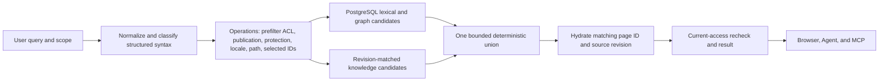

# Search architecture

PostgreSQL Advanced is the sole production search engine. `operations.search` is the implemented unified lexical-plus-knowledge owner for browser, Agent, MCP, and API search; focused implementation and benchmark evidence is recorded in [the foundation audit](search-foundation-audit.md). This is not a deployment or complete-release claim.

## Design decisions

- **PostgreSQL full-text search is the primary retriever.** Weighted `tsvector` fields and `websearch_to_tsquery` provide stemming, quoted phrases, negation, and forgiving user syntax.
- **Cover-density ranking instead of a BM25 extension.** `ts_rank_cd` rewards dense term coverage and preserves PostgreSQL's built-in GIN execution path. A BM25 extension would add deployment, upgrade, backup, and availability coupling without improving the Wiki-specific title, tag, path, and link signals that dominate useful ranking.
- **Metadata-aware reranking.** Exact title, exact tag, exact path, title prefix, tag prefix, and trigram similarity add deterministic boosts above the lexical score.
- **Bounded graph support.** A recursive CTE traverses links only between the top lexical candidates, to depth two. It can distinguish a coherent linked cluster without turning every query into a whole-wiki graph walk or returning unrelated neighbors.
- **Fuzzy retrieval is a fallback.** Exact lexical and substring candidates run first. Trigram word similarity runs only when fewer than five exact candidates exist. This preserves typo tolerance without making common tag or keyword queries scan a broad fuzzy set.
- **Stable, inspectable rank signals.** Results carry final `score`, normalized `tags`, and lexical/graph `matchedFields`. The unified contract additionally permits `knowledge`, labeled **knowledge hints** in user interfaces; it is neither verified fact nor citation evidence. Scores have deterministic title and page-ID tie breakers.

## Engine contract and invariants

PostgreSQL Advanced applies an exact locale filter and an exact path-or-descendant filter before ranking and before the configured `search.maxHits` window. A path scope includes only the selected path or values beginning with `path/`; `%` and `_` are literal scope characters. The engine returns no more than the configured limit.

Rebuild success means the derived index is an authoritative replacement, including removal of documents absent from the canonical page corpus. Rebuild runs in one transaction: transactional truncation and all replacement writes commit together, while a failed rebuild rolls back to the prior derived state. A transaction-scoped advisory lock named `wiki.search.postgres.derived-index` prevents concurrent initializations or rebuilds; lock contention fails rather than permitting two writers.

The engine key is `postgres`. Fresh installations, upgraded deployments, browser configuration, Agent search, and MCP search all reconcile to this single provider; no alternate engine is selectable.

## Derived schema

`pagesVector` contains one row per published public page:

`pages` is authoritative. Search tables are derived projections and may be discarded and rebuilt.

| Column | Purpose |
| --- | --- |
| `pageId` | Canonical page identity and primary key |
| `sourceRevision` | Exact authoritative page revision represented by this vector |
| `path`, `locale` | Stable routing identity and scope filters |
| `title`, `description` | Result metadata and field-specific evidence |
| `tags` | Normalized tag values returned with results |
| `facets` | Title, path, description, and tags for substring/trigram retrieval |
| `tokens` | Weighted full-text vector |

Weights are: title and tags `A`, path and description `B`, content `C`. The index has:

- a GIN index on `tokens` for full-text retrieval;
- a GIN array index on normalized `tags` for bounded exact-tag retrieval;
- a trigram GIN index on `facets` for substring and typo retrieval;
- a unique locale/path identity index.

`pagesWords` stores per-page, unstemmed metadata terms. Its trigram GIN index supports spelling suggestions while page identity makes mutation-time replacement bounded and exact.

`pagesSearchMetadata` is the singleton schema contract. Contract ID `1` records search schema version `2` and the configured PostgreSQL text-search dictionary. Initialization validates the complete column, primary-key, index validity/readiness, access-method, indexed-column, and operator-class contract. Any mismatch recreates the derived schema before rebuilding; a dictionary change also forces a rebuild. Startup additionally compares every eligible page's `sourceRevision` with `pagesVector.sourceRevision` and removes orphaned or ineligible vectors through the same rebuild path.

The PostgreSQL engine also ensures source-side indexes on `pageLinks.pageId`, `pageTags.pageId`, and `pageTags.tagId`. Existing target path/locale and page identity indexes resolve graph edges without denormalizing the link graph.

## Query pipeline

### Unified pipeline

`operations.search` supplies bounded authorized public IDs to PostgreSQL, asks the knowledge repository for candidates constrained by the same public/private and selected-page scope, and orders the combined candidates once. The Agent no longer maintains a local knowledge union, cap, ranking, or access path.

The engine owns query classification. Quotes, standalone case-insensitive `OR`, and token-boundary negation are structured input. Structured input does not enter raw substring, fuzzy, acronym, or generated-hint fallbacks that change its semantics; ordinary hyphenated identifiers remain ordinary input. Blank trimmed input is empty across public, private, and knowledge retrieval. Locale/path (including literal `%`/`_`), selected page IDs, ACL, current publication window, and protection filter before a candidate cap. The raw 500-candidate cutoff cannot hide an authorized result inside an earlier unauthorized window.

The graph score is capped at `1.25`: explicit links may settle close lexical candidates but must never let graph support alone outrank an exact title or tag. The protected-bridge violation (public 71 → protected 70 → public 69) is corrected and native-retested: protected related output/knowledge disappeared, public scores dropped 7.4925 → 6.75, and a public direct link restored the expected distance-one graph signal. The stale-edge worker-stall repair is also verified: during page 70 revision 2's held running `links` receipt, `links[]` was empty and depth-one related returned only public incoming 71; after lease release, a real worker recorded a succeeded receipt and removed old 70 edges. Engine candidates pin the authorized revision map before caps, source edges require current succeeded link receipts, and raw edge revision/routes are compared with that snapshot. In session observation, deleted synthetic page 69 render/links receipts were recreated by a normal worker at exact revision 1, proving bounded legacy backfill; the retained benchmark artifact (`docs/benchmarks/search-graph-boundary-2026-09-07.json`) records this recovery under `legacyRenderAndLinksRecovered: true` alongside an empty `receipts: []` array rather than retaining individual receipt rows. Public lexical candidates still honor empty dates as open bounds where the page contract permits, compare offset-bearing ISO dates as instants, and fail closed for invalid dates/windows. Private pages remain outside the shared index, use the owner-or-system-manager `canReadPage` authority for direct path reads, and contribute at most 50 results regardless of the public window.

## Wiki content as Agent and MCP memory

Wiki pages are shared, mutable, citable external knowledge. They complement the Wiki Agent's bounded personal memory rather than replacing it. Durable preferences and stable user-specific facts belong in dedicated memory; facts that can be rediscovered from Wiki pages stay in the Wiki and are retrieved when needed.

### OpenWiki comparison boundary

OpenWiki's Code Wiki Claims use stable claim IDs, resolver-owned versioned evidence, stale/unresolved state, and confirm/update/retract reconciliation; its provenance discipline preserves extensions and competing credible sources. tsEpistle deliberately does not implement Claims sidecars, evidence IDs, or contradiction reconciliation. Its authoritative layer is database-backed pages/history, dynamic ACL, `pageTags`, and server-owned OKF authority; projections and generated hints are revisioned retrieval data only. They never become citation authority or automatically enter the separate owner-scoped personal-memory snapshot.

Agent chat and MCP use the grounded retrieval sequence below. The shared search operation is the implemented candidate path; it is still selection metadata rather than page-read evidence:

1. `pages.search` / `wiki_search_pages` finds lexical, tag, path, and graph-supported seeds, including spelling suggestions.
2. `pages.searchTags` / `wiki_search_tags` searches the existing taxonomy while `pages.listTags` / `wiki_list_tags` pages through it deterministically.
3. `pages.discover` / `wiki_discover_pages` browses authorized page summaries by locale, descendants beneath a path, nested depth, exact tags, and stable path, title, or update order.
4. `pages.related` / `wiki_get_related_pages` optionally expands a seed through explicit internal Wiki links and backlinks.
5. `pages.get` / `wiki_get_page` reads each promising page before its content is used.
6. Answers cite the retrieved page evidence.

`pages.related` is deliberately separate from the latency-sensitive search reranker. Its required contract is an undirected adjacency graph built only from current, published, publication-window-open, unprotected pages authorized for the requester; every returned node and every bridge must satisfy those conditions. Traversal remains deterministic breadth-first with at most 100 pages, opaque requester/seed/depth-bound cursor state, optional `maxDepth` 1..32, shortest-distance then title/path/ID order, edge direction, and predecessor ID. Current body-read authorization must be rechecked before related knowledge is attached.

[`search-graph-boundary-2026-09-07.json`](benchmarks/search-graph-boundary-2026-09-07.json) records the protected-bridge score drop, visible-link control, held-receipt `links[]` result, no stale 69 traversal, released-lease edge deletion, and legacy receipt recovery (attested via `legacyRenderAndLinksRecovered: true` with empty `receipts: []`, reflecting session observation of exact revision-1 recreation). Graph admission now requires preauthorized revision pins and current succeeded link receipts before cap/ranking, then compares raw edge revision/routes to the authorization snapshot. Public metadata lexical behavior remains separate while protected endpoints never contribute graph score, graph traversal, or body-derived knowledge attachment.

Internal Wiki links are durable graph edges derived from canonical authored content. A page mutation records a `links` projection intent alongside the authoritative page revision; the projection worker replaces `pageLinks` only after validating that immutable intent against the current page identity and source hash. Agent instructions and Agent/MCP proposal descriptions therefore require authors to search and read related pages before a knowledge-changing create or patch, then add canonical links and precise tags only when supported by the page content. Links remain visible, reviewable, and reproducible from page history; the Agent must not invent invisible edges merely to influence retrieval.

`pages.listLinks` / `wiki_list_page_links` reports only canonical internal page links. External URLs and rendered asset references are not stored in `pageLinks` and are therefore not advertised by this contract.

## Mutation and rebuild lifecycle

- Page mutations persist authoritative page state and immutable `render`, `links`, `search`, and `knowledge` intents in the durable `pageMutationOutbox`. Each intent is keyed by page, source revision, desired presence, and effect kind; its canonical payload and SHA-256 hash are validated fail-closed before execution or repair.
- Workers claim bounded batches with expiring leases and heartbeats. A lost lease cannot complete an effect, failures retain durable retry state, and superseded revisions cannot overwrite a newer projection.
- A `search` intent waits for the exact revision's render intent to succeed. Published public pages are reconciled through the PostgreSQL engine; private, unpublished, and absent pages have both `pagesVector` and `pagesWords` removed. Success is recorded only after `pagesVector.sourceRevision` proves the current authoritative revision, or after absence of both derived rows is proven.
- Search maintenance scans bounded sets for missing current-revision intents, revision mismatches, orphan vectors, and stale suggestion rows. It re-arms only an immutable payload that still matches the current page revision, identity, and source hash. Payload or hash corruption remains terminal evidence rather than being silently rewritten.
- Knowledge projection is independently maintained repairable state, never a second access-control or citation system. `operations.search` queries only exact-current projections with the same publication, ACL, selected-ID, locale/path, private-owner/system-manager, and protected-source constraints as lexical candidates before cap/union. Projection schema 2 persists normalized `searchTokens` using the configured dictionary and a GIN index; a dictionary change invalidates/rebuilds this derived search state. `searchVisible` returns no projection candidates for structured syntax, preventing summary/hint matches from bypassing quoted/negated/`OR` source semantics. Lifecycle discovers missing current/history projections, schema/version mismatch, revision mismatch, and repairable utility absence from validated immutable intent. A requested exact revision that is absent or mismatched fails closed; it never falls back to current data. Markdown link extraction excludes code spans/fences, bounds labels, and preserves an unavailable source line as nullable/unknown rather than inventing it.

Utility enrichment is outside requester-scoped retrieval. The configured conformed profile is an operator-approved shared-content processor: preflight checks current revision/source hash, public visibility, publication window, and password/protection state, not requester/page-rule/anonymous-read ACL. It may receive published shared ACL-restricted pages; a private, protected, unpublished, scheduled, expired, or invalid-window source found at preflight is not dispatched. Retrieval still enforces requester ACL. Utility has no tools, accepts strict bounded schema output only for declared projection gaps, and cannot write authority/source/tags/verification; neither that prompt nor generated text is an injection-proof or semantic-truth guarantee. Post-dispatch eligibility changes discard output but cannot retract bytes already transmitted. Schema-2 `searchTerms` backfill may invoke it once per eligible current page; operators must approve the shared corpus/provider and review total budget because there is no total backfill-cost quota.
- Rename and delete intents carry the prior identity or desired absence, so stale link/search identities are evicted without treating a derived row as source truth.
- Activation validates or recreates the search schema and performs a rebuild when its schema, dictionary, or source revisions are stale. An explicit rebuild truncates the derived tables inside the advisory-locked transaction, then walks published public page identities in bounded keyset-cursor batches. Each canonical rendered document is indexed before the next identity batch is loaded; rollback restores the prior derived state on any failure.

Protected pages do not contribute content tokens during indexing or rebuild. Protected body-derived projection hints are barred from direct lexical/knowledge retrieval; the graph-path exception was resolved by protected-endpoint/current-body fencing and exact-current-revision succeeded-receipt gating. Visible metadata is evaluated only if product policy permits it and under the same structured semantics. Private pages stay outside the shared index and are searched locally for the owner or authorized system manager. The fixed private contribution is at most 50 results regardless of the requested public window.

## Wiki Agent contract

`pages.search` is the Agent projection of the shared operation, not a second retriever. It returns bounded hydrated summaries with:

- canonical page identity and the matching source revision;
- tags, numeric rank, lexical/graph/`knowledge` matched fields, and spelling suggestions;
- `totalInWindow`, `windowLimit`, and `windowTruncated` for the bounded candidate window rather than a whole-wiki total; and
- `nextOffset`, which advances raw candidates even if a page disappears during hydration.

Hydration rejects a candidate whose page ID/source revision no longer identifies the returned route. A projection is attached only when it shares the hydrated page revision. Expected locked/unavailable candidates are omitted without aborting unrelated results. The public/default candidate limit is 100 and the independent private contribution limit is 50.

`pages.searchTags` returns at most 20 normalized matching tag values. `pages.listTags` returns at most 100 stable tag records per call with `nextOffset`.

`pages.discover` returns authorized summaries without requiring a keyword. Its candidate traversal includes published public pages plus private pages admitted by the requester's owner or system-manager scope; unpublished public pages are never candidates. It supports one locale, descendants beneath a path, up to five additional nested levels below direct children (`depth: 0` returns direct children), up to 20 exact normalized tags that must all match, and stable path, title, or update order. Each response contains at most 100 pages. Discovery considers at most 5,000 candidates and rejects broader scopes with `PAGE_INDEX_TOO_BROAD`; the caller must choose a narrower path.

`pages.related` returns bounded hydrated graph neighbors with:

- citations, canonical identity, and tags;
- shortest link distance;
- incoming, outgoing, or bidirectional edge direction;
- the preceding page ID on the deterministic breadth-first route;
- opaque signed `nextCursor` continuation state instead of a client-controlled offset.

The cursor is bound to the requester, seed page, and optional `maxDepth`. Tampering or reusing it with a different traversal returns `INVALID_RELATED_CURSOR`.

The action descriptions instruct the model to use search evidence to select seeds, expand explicit relationships when useful, and call `pages.get` before answering. Search and graph evidence guide selection; page content remains the citable source of truth.

### Citation evidence gate

Search, recent-page, discovery, and related-page outputs are candidate metadata. Their evidence IDs cannot enter a final answer until the same page has been read by `pages.get` or `pages.getVersion` during the active run. Evidence from prior conversation turns is intentionally ineligible because the page may have changed.

Final drafts are buffered before publication and checked as follows:

1. Every `[[cite:...]]` marker must resolve to a successful active-run page read.
2. The immediately preceding clause is retained as the claim associated with that marker.
3. Page-level claims are compared with the complete read content. Markdown section claims are compared only with the corresponding heading scope and its citation label.
4. Each conjunction- or colon-delimited subclause must have at least 60 percent significant normalized term overlap with the evidence, with a one- or two-term minimum for short subclauses. Claim negation must also occur in the evidence.
5. Verification language such as “I verified,” “I checked,” or “the page says” requires both a completed page read and an associated citation.
6. A final answer may contain at most 20 citation markers.

An invalid draft is never streamed to the user. The provider receives bounded correction feedback and may read the missing page, select the correct section, or rewrite the claim within the normal turn limit. Adjacent claims from one page should remain in one readable sentence or paragraph, with each section marker immediately following its own supported clause.

Every checked draft emits a bounded `evidence.provenance` event. It records whether the draft was accepted, ordered retrieval action IDs and evidence IDs, each claim's page and section evidence, the originating read action, matched terms, validation issues, and final citation order. Existing `tool.completed` events retain the full ordered tool outputs, so debugging can distinguish candidate discovery, page retrieval, claim attribution, and final rendering.

## Performance envelope

Two executable benchmarks cover different contracts and must not be compared as if they measured the same path:

- `bun run benchmark:page-index` measures the discovery repository's bounded page-index candidate read, principals, overflow sentinel, query count, connection use, heap growth, and PostgreSQL plan counters. It does not invoke the search engine.
- `bun run benchmark:postgres-search` uses an isolated PostgreSQL 17 container and a deterministic 20,000-page corpus (seed `20_260_831`) to measure rebuild and warmed engine distributions. It must never write to a production database.

The retained lexical baseline in [`search-foundation-before-2026-09-07.json`](benchmarks/search-foundation-before-2026-09-07.json) recorded recall@5 `0.8181818181818182` and zero-result rate `0.18181818181818182` over 11 seeded queries; it preserves the `AFR` and held-out paraphrase misses as diagnostics. The final isolated PostgreSQL 17.10 report, [`search-foundation-after-2026-09-07.json`](benchmarks/search-foundation-after-2026-09-07.json), passed with no threshold violations: its required four-case lexical acceptance scope passed, and its separate revisioned augmented fixture scored recall@5/MRR@5/nDCG@5 `1.0` with zero-result rate `0` across the same 11-query corpus. Rebuild time was **25,772.876510 ms**, with query p95 latencies of **26.583659 ms** for exact title/content (p50 23.742542 ms), **24.870621 ms** for typo/fuzzy (p50 24.150178 ms), **31.693809 ms** for multi-term description (p50 26.985204 ms), and **62.194827 ms** for common tag queries (p50 60.943106 ms), all well below the 200 ms threshold. The fixture is deterministic repository/union evidence, not actual utility-model output.

Actual configured-utility evidence is separately retained in `docs/benchmarks/search-utility-before-2026-09-07.json` and `docs/benchmarks/search-utility-after-2026-09-07.json`. The latter successful `gpt-5.6-luna` request generated four novel terms and passed term-ingestion, `AFR`, selected-scope, structured-query, and absent-query controls, but `restore the ultraviolet verification code` still returned no result. The reports must not be compared as if they measured one path, and neither makes a universal semantic-recall or model-equivalence claim.

## Projection observability

- `wiki_page_mutation_effects` reports durable render, links, and knowledge effects by lifecycle status. `wiki_page_mutation_oldest_eligible_age_seconds` and `wiki_page_mutation_expired_running_leases` expose queue delay and abandoned work across eligible effects.
- `wiki_page_search_documents{kind=\"eligible_pages\"}` and `{kind=\"indexed_vectors\"}` expose the authoritative/derived document counts.
- `wiki_page_search_vector_anomalies{kind=\"revision_mismatch\"}` detects vectors whose `sourceRevision` differs from the authoritative page, while `{kind=\"orphan\"}` detects vectors for missing, private, or unpublished pages.
- `wiki_page_knowledge_projection_gaps` counts authoritative pages without a knowledge projection for the current source revision.

Search document counts are not a sufficient correctness check by themselves: equal counts can still hide a revision mismatch and an orphan. Alerting should evaluate the vector anomaly gauges together with durable-effect age and failure status. Derived-state repair may re-arm matching immutable intent; operators must investigate payload/hash validation failures rather than bypassing them.

## Operational evidence and remaining record

Implementation gates include four real PostgreSQL suites (**21 cases / 61 assertions**: knowledge search 4/10, utility admission 3/5, search foundation 12/37, and search graph rank 2/9), server and shared/client types, and all scoped files; the full test suite passes **472/472 isolated files**. The isolated report, migrated MCP-focused tests (7/7), native reader/browser accessibility, continuation, search/tree/preview/focus proof, least-privilege MCP read/resource/revocation proof, and resolved graph-boundary proof are recorded in [the foundation audit](search-foundation-audit.md). The reader and admin evaluator had zero WCAG 2 A/AA and 2.1 AA violations in the observed light/dark scenarios; the final browser heading is **Search results**.

The current build used explicit supported `WIKI_BUILD_REVISION` content fingerprint `3adffcba7255a3f88ec490ceffefe6f826e9508a`, not a Git revision; the worktree remains intentionally uncommitted and is not deployed. Retained live attestation in `docs/benchmarks/search-foundation-live-2026-09-07.json` confirms `source.deployedToMaintainedInstance: false`, `maintainedAuthoritativeState.pagesUnchanged: true`, `pageHistoryUnchanged: true`, `settingsUnchanged: true`, and `repositoryBindMounts: 0` (raw private fingerprints were verified during audit but are not retained in repo artifacts). Cleanup of disposable audit tooling, sensitive restored artifacts, and clone infrastructure is complete based on current evidence (`docs/benchmarks/search-foundation-live-2026-09-07.json` records `cleanup.completed: true`, all resource cleanup booleans true, and `remaining: []`).

The former monolithic `Covered source` mechanism and the external-review release prerequisite are historical and superseded. The 2026-09-04 legacy baseline and 2026-09-07 search audit retain their historical `SEC-EXT-001` finding and release-ineligible status; schema-2 migration changes only record representation, preserving those findings and statuses. Those records preserve what was observed under the former policy and do not define the current gate. The search audit is a `working-tree-audit` with fingerprint `3adffcba7255a3f88ec490ceffefe6f826e9508a` (base `d3d5a63326c056bb847fdb2552be0a1cf1eb7020`), not a release attestation.

Current release authority is the maintainer-owned schema-2 threat-model contract in [`docs/security/threat-model.md`](security/threat-model.md) and [`docs/security/review-attestations.json`](security/review-attestations.json). The manifest and review records use `schemaVersion: 2`; `policyVersion: 1` and `modelVersion: 1` remain unchanged. After source freeze, a maintainer/agent `source-review` may qualify a release only when it is active and `releaseEligible: true`, has no blocking findings, binds the current model digest, matches HEAD's computed covered-tree digest exactly, contains real repository-contained evidence, and passes the clean-tree check. A working-tree audit remains release-ineligible and cannot be active; no external reviewer or detached signature is required.

No embedding generation or document-chunk synchronization is required. Search vectors and knowledge records remain asynchronous, repairable projections from durable mutation intent and authoritative pages/history.
