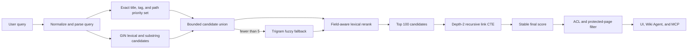

# Search architecture

Wiki search exposes PostgreSQL Advanced as its sole engine. The browser UI, Wiki Agent, and MCP all use this shared PostgreSQL retrieval contract, so scope, ranking, suggestions, and rebuild behavior stay consistent across every caller.

## Design decisions

- **PostgreSQL full-text search is the primary retriever.** Weighted `tsvector` fields and `websearch_to_tsquery` provide stemming, quoted phrases, negation, and forgiving user syntax.
- **Cover-density ranking instead of a BM25 extension.** `ts_rank_cd` rewards dense term coverage and preserves PostgreSQL's built-in GIN execution path. A BM25 extension would add deployment, upgrade, backup, and availability coupling without improving the Wiki-specific title, tag, path, and link signals that dominate useful ranking.
- **Metadata-aware reranking.** Exact title, exact tag, exact path, title prefix, tag prefix, and trigram similarity add deterministic boosts above the lexical score.
- **Bounded graph support.** A recursive CTE traverses links only between the top lexical candidates, to depth two. It can distinguish a coherent linked cluster without turning every query into a whole-wiki graph walk or returning unrelated neighbors.
- **Fuzzy retrieval is a fallback.** Exact lexical and substring candidates run first. Trigram word similarity runs only when fewer than five exact candidates exist. This preserves typo tolerance without making common tag or keyword queries scan a broad fuzzy set.
- **Stable, inspectable evidence.** Every result carries its final `score`, normalized `tags`, and `matchedFields` (`title`, `tag`, `path`, `description`, `content`, or `graph`). Scores have deterministic title and page-ID tie breakers.

## Engine contract and invariants

PostgreSQL Advanced applies an exact locale filter and an exact path-or-descendant filter before ranking and before the configured `search.maxHits` window. A path scope includes only the selected path or values beginning with `path/`; `%` and `_` are literal scope characters. The engine returns no more than the configured limit.

Rebuild success means the derived index is an authoritative replacement, including removal of documents absent from the canonical page corpus. Rebuild runs in one transaction: transactional truncation and all replacement writes commit together, while a failed rebuild rolls back to the prior derived state. A transaction-scoped advisory lock named `wiki.search.postgres.derived-index` prevents concurrent initializations or rebuilds; lock contention fails rather than permitting two writers.

The engine key is `postgres`. Fresh installations, upgraded deployments, browser configuration, Agent search, and MCP search all reconcile to this single provider; no alternate engine is selectable.

## Derived schema

`pagesVector` contains one row per published public page:

`pages` is authoritative. Search tables are derived projections and may be discarded and rebuilt.

| Column | Purpose |
| --- | --- |
| `pageId` | Canonical page identity and primary key |
| `sourceRevision` | Exact authoritative page revision represented by this vector |
| `path`, `locale` | Stable routing identity and scope filters |
| `title`, `description` | Result metadata and field-specific evidence |
| `tags` | Normalized tag values returned with results |
| `facets` | Title, path, description, and tags for substring/trigram retrieval |
| `tokens` | Weighted full-text vector |

Weights are: title and tags `A`, path and description `B`, content `C`. The index has:

- a GIN index on `tokens` for full-text retrieval;
- a GIN array index on normalized `tags` for bounded exact-tag retrieval;
- a trigram GIN index on `facets` for substring and typo retrieval;
- a unique locale/path identity index.

`pagesWords` stores per-page, unstemmed metadata terms. Its trigram GIN index supports spelling suggestions while page identity makes mutation-time replacement bounded and exact.

`pagesSearchMetadata` is the singleton schema contract. Contract ID `1` records search schema version `2` and the configured PostgreSQL text-search dictionary. Initialization validates the complete column, primary-key, index validity/readiness, access-method, indexed-column, and operator-class contract. Any mismatch recreates the derived schema before rebuilding; a dictionary change also forces a rebuild. Startup additionally compares every eligible page's `sourceRevision` with `pagesVector.sourceRevision` and removes orphaned or ineligible vectors through the same rebuild path.

The PostgreSQL engine also ensures source-side indexes on `pageLinks.pageId`, `pageTags.pageId`, and `pageTags.tagId`. Existing target path/locale and page identity indexes resolve graph edges without denormalizing the link graph.

## Query pipeline

The graph score is deliberately capped at `1.25`. Links can settle close lexical results, but cannot outrank an exact title or exact tag by themselves.

Locale and path filters are part of both exact and fuzzy candidate selection. Path scope means the selected path itself or descendants under `path/`; wildcard characters remain literal.

Search accepts PostgreSQL web-search syntax: quote a phrase to require adjacent terms and prefix an unwanted term with `-` to exclude it. Agent and MCP callers can apply the same exact-locale and path-or-descendant filters as the UI.

## Wiki content as Agent and MCP memory

Wiki pages are shared, mutable, citable external knowledge. They complement the Wiki Agent's bounded personal memory rather than replacing it. Durable preferences and stable user-specific facts belong in dedicated memory; facts that can be rediscovered from Wiki pages stay in the Wiki and are retrieved when needed.

Both Agent chat and MCP expose the same grounded retrieval sequence:

1. `pages.search` / `wiki_search_pages` finds lexical, tag, path, and graph-supported seeds, including spelling suggestions.
2. `pages.searchTags` / `wiki_search_tags` searches the existing taxonomy while `pages.listTags` / `wiki_list_tags` pages through it deterministically.
3. `pages.discover` / `wiki_discover_pages` browses authorized page summaries by locale, descendants beneath a path, nested depth, exact tags, and stable path, title, or update order.
4. `pages.related` / `wiki_get_related_pages` optionally expands a seed through explicit internal Wiki links and backlinks.
5. `pages.get` / `wiki_get_page` reads each promising page before its content is used.
6. Answers cite the retrieved page evidence.

`pages.related` is deliberately separate from the latency-sensitive search reranker. It constructs an undirected adjacency graph from canonical `pageLinks`, then performs deterministic breadth-first traversal:

- every directly linked page is distance one; traversal depth counts edges, not the number of neighbors;
- each response contains at most 100 pages; an opaque signed `nextCursor` continues from the exact requester, seed page, and depth scope until the connected component is exhausted;
- an optional `maxDepth` from 1 through 32 supports deliberately local exploration;
- ordering is shortest distance, then title, path, and page ID;
- results include distance, incoming/outgoing/bidirectional direction, and the preceding page ID;
- only published public pages authorized for the requester enter the adjacency graph, so an inaccessible page can neither appear nor act as a hidden bridge.

The breadth-first walk runs over a set-based PostgreSQL edge read rather than inside the search CTE. Authorization rules can depend on live path, locale, and tags, so filtering nodes before constructing adjacency is safer than traversing the database graph first and filtering results afterward. The search CTE remains a candidate-only depth-two reranker; `pages.related` provides intentional broad graph retrieval.

Internal Wiki links are durable graph edges derived from canonical authored content. A page mutation records a `links` projection intent alongside the authoritative page revision; the projection worker replaces `pageLinks` only after validating that immutable intent against the current page identity and source hash. Agent instructions and Agent/MCP proposal descriptions therefore require authors to search and read related pages before a knowledge-changing create or patch, then add canonical links and precise tags only when supported by the page content. Links remain visible, reviewable, and reproducible from page history; the Agent must not invent invisible edges merely to influence retrieval.

`pages.listLinks` / `wiki_list_page_links` reports only canonical internal page links. External URLs and rendered asset references are not stored in `pageLinks` and are therefore not advertised by this contract.

## Mutation and rebuild lifecycle

- Page mutations persist authoritative page state and immutable `render`, `links`, `search`, and `knowledge` intents in the durable `pageMutationOutbox`. Each intent is keyed by page, source revision, desired presence, and effect kind; its canonical payload and SHA-256 hash are validated fail-closed before execution or repair.
- Workers claim bounded batches with expiring leases and heartbeats. A lost lease cannot complete an effect, failures retain durable retry state, and superseded revisions cannot overwrite a newer projection.
- A `search` intent waits for the exact revision's render intent to succeed. Published public pages are reconciled through the PostgreSQL engine; private, unpublished, and absent pages have both `pagesVector` and `pagesWords` removed. Success is recorded only after `pagesVector.sourceRevision` proves the current authoritative revision, or after absence of both derived rows is proven.
- Search maintenance scans bounded sets for missing current-revision intents, revision mismatches, orphan vectors, and stale suggestion rows. It re-arms only an immutable payload that still matches the current page revision, identity, and source hash. Payload or hash corruption remains terminal evidence rather than being silently rewritten.
- Knowledge projection is maintained independently from search retrieval. Its lifecycle discovers missing current/history projections, retries eligible work, and re-arms failed durable `knowledge` effects only from validated canonical intent. `pages` and page history remain authoritative; `pageKnowledgeProjections` is repairable derived state.
- Rename and delete intents carry the prior identity or desired absence, so stale link/search identities are evicted without treating a derived row as source truth.
- Activation validates or recreates the search schema and performs a rebuild when its schema, dictionary, or source revisions are stale. An explicit rebuild truncates the derived tables inside the advisory-locked transaction, then walks published public page identities in bounded keyset-cursor batches. Each canonical rendered document is indexed before the next identity batch is loaded; rollback restores the prior derived state on any failure.

Protected pages never contribute content tokens during either incremental indexing or rebuild. Their visible title, path, description, and tags remain searchable. Private pages stay outside the shared index and are searched only inside the requester's owner scope. Private retrieval applies the requested locale and path scope and matches title, description, content, path, and tags before merging results into the same deterministic ordering.

## Wiki Agent contract

`pages.search` returns bounded hydrated page summaries with:

- citations and canonical page identity;
- tags, numeric rank, and matched fields;
- spelling `suggestions`;
- `totalInWindow`, the number of authorized raw hits available inside the bounded search window;
- `windowLimit` and `windowTruncated`, which distinguish an exhausted result set from one capped by the public or private retrieval window;
- `nextOffset`, which advances through raw hits even if a page is deleted between retrieval and hydration.

The shared PostgreSQL index contributes at most the configured search maximum, 100 by default. An owner-scoped private search contributes at most 50 additional hits. These are candidate-window semantics, not a whole-wiki total.

`pages.searchTags` returns at most 20 normalized matching tag values. `pages.listTags` returns at most 100 stable tag records per call with `nextOffset`.

`pages.discover` returns authorized summaries without requiring a keyword. Its candidate traversal includes published public pages plus private pages admitted by the requester's owner or system-manager scope; unpublished public pages are never candidates. It supports one locale, descendants beneath a path, up to five additional nested levels below direct children (`depth: 0` returns direct children), up to 20 exact normalized tags that must all match, and stable path, title, or update order. Each response contains at most 100 pages. Discovery considers at most 5,000 candidates and rejects broader scopes with `PAGE_INDEX_TOO_BROAD`; the caller must choose a narrower path.

`pages.related` returns bounded hydrated graph neighbors with:

- citations, canonical identity, and tags;
- shortest link distance;
- incoming, outgoing, or bidirectional edge direction;
- the preceding page ID on the deterministic breadth-first route;
- opaque signed `nextCursor` continuation state instead of a client-controlled offset.

The cursor is bound to the requester, seed page, and optional `maxDepth`. Tampering or reusing it with a different traversal returns `INVALID_RELATED_CURSOR`.

The action descriptions instruct the model to use search evidence to select seeds, expand explicit relationships when useful, and call `pages.get` before answering. Search and graph evidence guide selection; page content remains the citable source of truth.

### Citation evidence gate

Search, recent-page, discovery, and related-page outputs are candidate metadata. Their evidence IDs cannot enter a final answer until the same page has been read by `pages.get` or `pages.getVersion` during the active run. Evidence from prior conversation turns is intentionally ineligible because the page may have changed.

Final drafts are buffered before publication and checked as follows:

1. Every `[[cite:...]]` marker must resolve to a successful active-run page read.
2. The immediately preceding clause is retained as the claim associated with that marker.
3. Page-level claims are compared with the complete read content. Markdown section claims are compared only with the corresponding heading scope and its citation label.
4. Each conjunction- or colon-delimited subclause must have at least 60 percent significant normalized term overlap with the evidence, with a one- or two-term minimum for short subclauses. Claim negation must also occur in the evidence.
5. Verification language such as “I verified,” “I checked,” or “the page says” requires both a completed page read and an associated citation.
6. A final answer may contain at most 20 citation markers.

An invalid draft is never streamed to the user. The provider receives bounded correction feedback and may read the missing page, select the correct section, or rewrite the claim within the normal turn limit. Adjacent claims from one page should remain in one readable sentence or paragraph, with each section marker immediately following its own supported clause.

Every checked draft emits a bounded `evidence.provenance` event. It records whether the draft was accepted, ordered retrieval action IDs and evidence IDs, each claim's page and section evidence, the originating read action, matched terms, validation issues, and final citation order. Existing `tool.completed` events retain the full ordered tool outputs, so debugging can distinguish candidate discovery, page retrieval, claim attribution, and final rendering.

## Performance envelope

Two executable benchmarks cover different contracts and must not be compared as if they measured the same path:

- `bun run benchmark:page-index` exercises the discovery repository's bounded page-index candidate read, authorization principals, overflow sentinel, query count, connection use, heap growth, and PostgreSQL plan counters. It does not invoke the search plugin.
- `bun run benchmark:postgres-search` starts an isolated PostgreSQL 17 container and invokes `server/modules/search/postgres/engine.ts` against a deterministic 20,000-page corpus (seed `20_260_831`) containing rendered content, normalized tags, and canonical links. It measures the plugin rebuild and warmed exact title/content, typo/fuzzy, multi-term description, and common-tag distributions.

The PostgreSQL search report records the PostgreSQL and `pg_trgm` versions, corpus seed and expected/observed shape, vector/suggestion counts and revision/orphan checks, search schema version and dictionary, engine caps, iterations, warmups, raw samples, nearest-rank percentiles, representative result checks, configured thresholds, and every violation. By default, every query distribution must meet a 200 ms p95 threshold; `POSTGRES_SEARCH_MAX_QUERY_P95_MS` provides an environment override. Representative correctness checks cover exact-title precedence, rendered-content retrieval, typo fallback, multi-term description retrieval, and common-tag cap/membership. Publication is an atomic JSON replacement; invariant or threshold failure still publishes the diagnostic report and exits nonzero. The wrapper refuses non-dedicated database names and removes its container on every exit, so it cannot read production data.

Measured timings are machine-specific and depend on machine load and PostgreSQL settings; they are not universal performance claims. No historical latency values are claimed here. A benchmark result is evidence only when retained from the executable command with its complete self-describing report.

## Projection observability

- `wiki_page_mutation_effects` reports durable render, links, and knowledge effects by lifecycle status. `wiki_page_mutation_oldest_eligible_age_seconds` and `wiki_page_mutation_expired_running_leases` expose queue delay and abandoned work across eligible effects.
- `wiki_page_search_documents{kind=\"eligible_pages\"}` and `{kind=\"indexed_vectors\"}` expose the authoritative/derived document counts.
- `wiki_page_search_vector_anomalies{kind=\"revision_mismatch\"}` detects vectors whose `sourceRevision` differs from the authoritative page, while `{kind=\"orphan\"}` detects vectors for missing, private, or unpublished pages.
- `wiki_page_knowledge_projection_gaps` counts authoritative pages without a knowledge projection for the current source revision.

Search document counts are not a sufficient correctness check by themselves: equal counts can still hide a revision mismatch and an orphan. Alerting should evaluate the vector anomaly gauges together with durable-effect age and failure status. Derived-state repair may re-arm matching immutable intent; operators must investigate payload/hash validation failures rather than bypassing them.

## Operational checks

After activating or upgrading the PostgreSQL engine:

1. Rebuild the search index once if activation did not already repair the schema or stale revisions; investigate advisory-lock contention instead of retrying concurrent rebuilds.
2. Confirm `pagesSearchMetadata` records contract ID `1`, schema version `2`, and the configured dictionary.
3. Confirm every published public page has one `pagesVector` row with the same `sourceRevision`, and that no ineligible or absent page retains vector or suggestion rows.
4. Confirm the `pages_vector_tokens_idx`, `pages_vector_tags_idx`, `pages_vector_facets_trgm_idx`, and `pages_words_word_trgm_idx` indexes are valid, ready, live, and use their expected operator classes.
5. Search an exact title, a tag, a content-only phrase, a quoted phrase, an excluded term, and a misspelling; confirm suggestions and window metadata.
6. Confirm locale and path scope work for public results and the owner's private title, content, path, and tag matches.
7. Confirm a protected content-only term is absent while the protected page's visible metadata remains searchable.
8. Confirm tag search, tag pagination, and structured discovery return only authorized records and reject an over-broad discovery scope.
9. Confirm `pages.related` returns authorized direct links and backlinks, continues a connected component with its opaque cursor, rejects a modified cursor, and does not traverse through a denied page.
10. Confirm the Wiki Agent calls search or discovery, optionally `pages.related`, then `pages.get`, and emits a page citation.
11. Use an adversarial page where an incident name appears in the introduction and procedures appear in another section. Confirm the wrong section is rejected, the corrected grouped answer is accepted, unsupported verification language is withheld, and `evidence.provenance` records the claim-to-section mapping.
12. Run `bun run benchmark:page-index` for discovery regressions and `bun run benchmark:postgres-search` for engine regressions; retain each atomic JSON report rather than transcribing isolated latency values.

No embedding generation or document-chunk synchronization is required. Search vectors and knowledge records are derived asynchronously from durable page-mutation intent and remain reproducible from authoritative pages and history.
