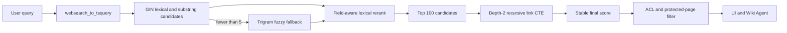

# Search architecture

Wiki search is a PostgreSQL-native hybrid lexical system. It deliberately uses no embeddings and requires no external search service. Page mutations update one compact derived index synchronously; an index rebuild reconstructs the same state directly from canonical Wiki tables.

## Design decisions

- **PostgreSQL full-text search is the primary retriever.** Weighted `tsvector` fields and `websearch_to_tsquery` provide stemming, quoted phrases, negation, and forgiving user syntax.
- **Cover-density ranking instead of a BM25 extension.** `ts_rank_cd` rewards dense term coverage and preserves PostgreSQL's built-in GIN execution path. A BM25 extension would add deployment, upgrade, backup, and availability coupling without improving the Wiki-specific title, tag, path, and link signals that dominate useful ranking.
- **Metadata-aware reranking.** Exact title, exact tag, exact path, title prefix, tag prefix, and trigram similarity add deterministic boosts above the lexical score.
- **Bounded graph support.** A recursive CTE traverses links only between the top lexical candidates, to depth two. It can distinguish a coherent linked cluster without turning every query into a whole-wiki graph walk or returning unrelated neighbors.
- **Fuzzy retrieval is a fallback.** Exact lexical and substring candidates run first. Trigram word similarity runs only when fewer than five exact candidates exist. This preserves typo tolerance without making common tag or keyword queries scan a broad fuzzy set.
- **Stable, inspectable evidence.** Every result carries its final `score`, normalized `tags`, and `matchedFields` (`title`, `tag`, `path`, `description`, `content`, or `graph`). Scores have deterministic title and page-ID tie breakers.

## Derived schema

`pagesVector` contains one row per published public page:

| Column | Purpose |
| --- | --- |
| `pageId` | Canonical page identity and primary key |
| `path`, `locale` | Stable routing identity and scope filters |
| `title`, `description` | Result metadata and field-specific evidence |
| `tags` | Normalized tag values returned with results |
| `facets` | Title, path, description, and tags for substring/trigram retrieval |
| `tokens` | Weighted full-text vector |

Weights are: title and tags `A`, path and description `B`, content `C`. The index has:

- a GIN index on `tokens` for full-text retrieval;
- a trigram GIN index on `facets` for substring and typo retrieval;
- a unique locale/path identity index.

`pagesWords` stores per-page, unstemmed metadata terms. Its trigram GIN index supports spelling suggestions while page identity makes mutation-time replacement bounded and exact.

The PostgreSQL engine also ensures source-side indexes on `pageLinks.pageId`, `pageTags.pageId`, and `pageTags.tagId`. Existing target path/locale and page identity indexes resolve graph edges without denormalizing the link graph.

## Query pipeline

The graph score is deliberately capped at `1.25`. Links can settle close lexical results, but cannot outrank an exact title or exact tag by themselves.

Locale and path filters are part of both exact and fuzzy candidate selection. Path scope means the selected path itself or descendants under `path/`; wildcard characters remain literal.

## Mutation and rebuild lifecycle

- Create and update events upsert the page vector and replace only that page's suggestion terms in one transaction.
- Rename events upsert the complete destination identity and current metadata; no stale title or path remains.
- Delete events remove the vector and suggestion terms in one transaction.
- Activation detects the legacy search schema, replaces the derived tables, creates the required indexes, and performs one rebuild.
- Rebuild truncates and repopulates both derived tables in one transaction. It uses set-based SQL rather than one insert per page.

Protected pages never contribute content tokens during either incremental indexing or rebuild. Their visible title, path, description, and tags remain searchable. Private pages stay outside the shared index and are searched only inside the requester's owner scope before being merged into the same deterministic result ordering.

## Wiki Agent contract

`pages.search` returns bounded hydrated page summaries with:

- citations and canonical page identity;
- tags;
- numeric rank;
- matched fields;
- total and truncation state.

The action description instructs the model to use this evidence to select candidates and call `pages.get` before answering. Search evidence helps selection; page content remains the citable source of truth.

## Performance envelope

Measured on PostgreSQL 17.11 with 20,000 synthetic published pages, 20,001 links, and 20,000 page-tag relations:

- full set-based index build: **2.724 s**;
- exact title/content query p95: **24.90 ms**;
- typo-tolerant query p95: **22.47 ms**;
- multi-term description query p95: **20.08 ms**;
- common tag query p95: **24.59 ms**.

Each query was warmed once and measured over 30 sequential executions with a 100-result cap. These numbers are a regression reference, not a universal capacity guarantee; production latency also includes authorization and page hydration.

## Operational checks

After activating or upgrading the PostgreSQL engine:

1. Rebuild the search index once if activation did not already replace the legacy schema.
2. Confirm `pagesVector` has one row per published public page.
3. Confirm the `pages_vector_tokens_idx` and `pages_vector_facets_trgm_idx` indexes are valid.
4. Search an exact title, a tag, a content-only phrase, and a misspelling.
5. Confirm a protected content-only term is absent while the protected page's visible metadata remains searchable.
6. Confirm the Wiki Agent calls `pages.search`, then `pages.get`, and emits a page citation.

No embedding generation, asynchronous vector queue, or document chunk synchronization is required.
